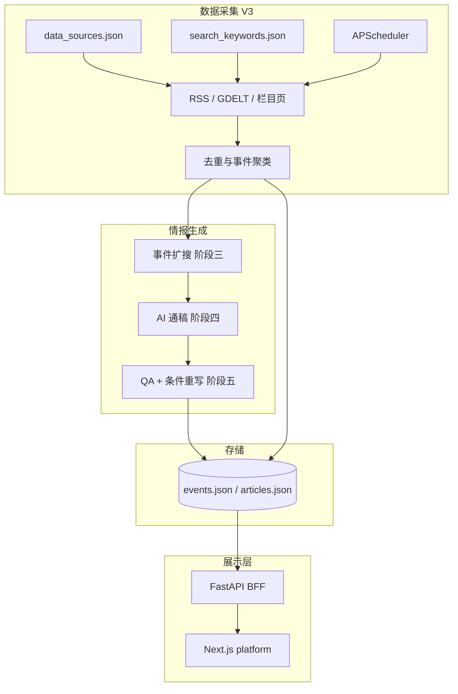

# 低空经济 Event Intelligence Platform

**多源资讯采集 → 事件聚类 → AI 通稿生成 → 质量审核 → 情报展示** 的端到端系统。  
核心建模单位是 **Event（事件）**，而非单篇文章；适用于政策/产业情报类场景的自动化研判与展示。

| 维度 | 说明 |
|------|------|
| 领域 | 低空经济、无人机、eVTOL、BVLOS 等 |
| 后端 | Python 3.11+ 流水线（`V3/`） |
| 前端 | Next.js 16 + TypeScript 情报工作台（`platform/`） |
| 分支 | 建议在 `v3-intelligence` 查看本版本 |

---

## 1. 要解决的问题

传统「抓文章 → 写摘要 → 推送」链路存在三点局限：

1. **信息碎片化**：同一政策/事故分散在多篇报道，难以形成统一叙事。  
2. **可信度难验证**：生成内容缺少与原文的对照与自动质检。  
3. **运维成本高**：数据源、关键词、定时策略分散在配置与脚本中，缺少统一入口。

本项目将链路升级为：**先聚类为事件，再生成事件级通稿，并配套 QA 与可视化溯源**。

---

## 2. 系统架构



**设计要点**

- **Event-first 数据模型**：`events.json` + `event_article_map.json`，通稿与 QA 元数据挂在事件上。  
- **分阶段流水线**：检索/聚类（必选）→ 扩搜（必选钩子）→ 通稿 → QA；各阶段可独立补跑（CLI）。  
- **BFF 解耦**：前端不直接读 JSON；`V3/src/bff` 聚合 DTO，并衍生 timeline、grounding 等展示字段。  
- **可演示资产**：`V3/data/demo/` 内置完整事件样本，无需外网检索即可验收 UI。

更细的流程见 `V3/docs/`（含 Mermaid 分模块说明）。

---

## 3. 技术栈

| 层级 | 技术 |
|------|------|
| 采集与编排 | Python、APScheduler、httpx、BeautifulSoup、trafilatura |
| 检索 | RSS 聚合、GDELT DOC、栏目 HTML 监控 |
| 聚类 / 去重 | 标题/正文相似度、可选 bge-m3 向量（sentence-transformers） |
| LLM | DeepSeek API（通稿、簇摘要、QA、条件重写） |
| 扩搜 | 独立包 `event_enhancement/`（PostgreSQL + Alembic 或 JSON 模式） |
| API | FastAPI + uvicorn |
| 前端 | Next.js App Router、TypeScript、Tailwind、React Query、Zustand、Recharts |
| 测试 | pytest（单元 + `tests/integration/` 集成脚本） |

---

## 4. 核心模块说明

| 模块 | 路径 | 职责 |
|------|------|------|
| 主流水线 | `V3/src/pipeline.py` | 检索、过滤、聚类、摘要/发布门禁 |
| 事件聚类 | `V3/src/ingest_cluster.py` | 向量转载合并、同事件并查集 |
| 事件扩搜 | `event_enhancement/`、`event_enhancement_workflow.py` | GDELT/RSS 级联扩搜、相似度门槛 |
| 通稿生成 | `V3/src/services/ai_press_writer/` | 多稿选材 → `event_press_zh` |
| 质量控制 | `V3/src/services/qa_rewrite/` | 评分、幻觉标记、未达标则重写（最多 N 轮） |
| 配置 | `V3/config/*.json`、`V3/.env` | 数据源、关键词、调度时刻 |
| BFF | `V3/src/bff/` | REST API，供前端与配置管理 |
| 情报 UI | `platform/` | Dashboard、Events、Event Detail（溯源/QA）、采集配置 |

**Event Detail 页**（`platform/app/events/[id]`）集中体现产品差异：时间线、AI 通稿、段落级 source grounding、来源稿相似度、QA 指标与重写历史。

---

## 5. 复现（约 10 分钟）

> 使用仓库内 **demo 数据**，不依赖 DeepSeek 与外网检索，即可验证前后端联调。

```bash
git clone -b v3-intelligence https://github.com/Czou-hahaha/wechat_auto_pipeline_project.git
cd wechat_auto_pipeline_project
```

**后端（终端 1）**

```bash
cd V3
python -m venv .venv && source .venv/bin/activate
pip install -r requirements.txt fastapi uvicorn
cp data/demo/*.json data/
PYTHONPATH=. python -m src.main run-bff
# 健康检查: http://127.0.0.1:8787/health
```

**前端（终端 2）**

```bash
cd platform
npm install
printf 'BFF_BASE_URL=http://127.0.0.1:8787\n' > .env.local
npm run dev
# http://localhost:3000
```

**建议验收路径**

| 步骤 | URL / 操作 | 关注点 |
|------|------------|--------|
| 1 | `/events/666eb4ad-9054-4ca8-8db6-8b800eadac9a` | 事件通稿、段落溯源、QA 分 95 |
| 2 | `/events` | 事件列表与 importance / QA 筛选 |
| 3 | `/settings` | 数据源、关键词、定时（08:00 / 20:00）配置 |
| 4 | `/` | Dashboard 指标与趋势图 |

BFF 未启动时，前端回退至 Mock，仍可查看界面交互。

**跑全链路（可选，需配置 `V3/.env` 中 `DEEPSEEK_API_KEY`）**

```bash
cd V3 && cp .env.example .env
PYTHONPATH=. python -m src.main run-once
```

---

## 6. 测试与质量

```bash
cd V3
PYTHONPATH=. python -m pytest tests/ -q
```

集成与 fixture 说明：`V3/tests/README.md`。

---

## 7. 仓库结构

```
├── V3/                  # 主流水线 + BFF + 文档 + demo 数据
├── platform/            # Next.js 情报前端
├── event_enhancement/   # 事件扩搜子系统（阶段三）
└── scripts/             # 运维脚本（如 push-v3-intelligence.sh）
```

子目录说明：[V3/README.md](V3/README.md)、[platform/README.md](platform/README.md)。

---

## 8. 版本说明

| 版本 | 说明 |
|------|------|
| `main`（远程） | 早期 article 级微信摘要流水线 |
| **`v3-intelligence`** | 本 README 对应版本：Event 情报 + Web 平台 |

---

## 9. 许可与合规

- 勿将 `.env` 或 API Key 提交至仓库。  
- 各新闻源、GDELT、模型 API 的使用须遵守相应服务条款。
