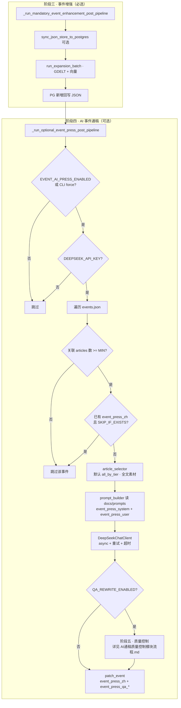

# AI 中文事件通稿（模块 4）流程说明

本文描述 **阶段四：基于同一 `event_id` 下多篇 `article` 生成一篇中文通稿**，及其与 **阶段三（事件增强）** 的衔接。实现代码见 `V3/src/services/ai_press_writer/`、`V3/src/event_press_workflow.py`；配置见根目录 `.env.example` 中 `EVENT_AI_PRESS_*`。

## 在整条链路中的位置

- **阶段一～二**：检索、抓取、去重、聚类与簇摘要落库（`articles.json` / `events.json` / `event_article_map.json`）。
- **阶段三（必选）**：事件增强（JSON↔PG、GDELT 扩搜、向量门槛），可能向同一事件追加新 URL 与稿件行。
- **阶段四（可选）**：在阶段三完成后，按事件聚合多篇稿件，经 **选文** 后调用 **DeepSeek**，将通稿写入 **`events.json`** 的 `event_press_zh`（及 `event_press_generated_at`）。**默认不把正文做字符截断**：各篇 `extracted_text` 全文作为素材进入 prompt（见下方 `EVENT_AI_PRESS_*`）；若遇厂商上下文上限或费用问题，可再打开单篇/总长/软预算截断。

> 若 `EVENT_AI_PRESS_ENABLED=false`，`run_once` 不跑阶段四；仍可用 CLI **`python -m src.main generate-event-press`** 对工作目录数据单独补跑（CLI 使用 `force=True`，仍受 `DEEPSEEK_API_KEY`、`EVENT_AI_PRESS_MIN_ARTICLES`、`EVENT_AI_PRESS_SKIP_IF_EXISTS` 约束）。

## 选文在做什么（不是「选事件」）

- **事件**已由外层限定：``run_event_press_generation`` 对每个 ``event_id`` 只取 ``articles_for_event`` 的若干行。
- **选文器**只在「这一事件」内部：决定 **哪些篇**、**什么顺序** 写进 user prompt 的 ``{articles}`` 块。篇幅控制**默认关闭**（全文进模型）；需要时再设 ``EVENT_AI_PRESS_PER_ARTICLE_MAX_CHARS`` / ``EVENT_AI_PRESS_MAX_USER_CHARS`` / ``EVENT_AI_PRESS_SOFT_TOKEN_BUDGET``。
- **默认** ``EVENT_AI_PRESS_SELECTION_MODE=all_by_tier``：按来源优先级排序，**同一事件下尽量多篇都进 prompt**（仅去掉 **resolved_url/source_url 完全相同** 的重复），篇数上限 ``EVENT_AI_PRESS_MAX_ARTICLES_IN_PROMPT``（默认 20），与阶段三扩搜「多源素材」一致；**不做**标题/正文头的转载近似剔除。
- 若需恢复「最多 5 篇 + 转载近似去重」以控费用或噪声，设 ``EVENT_AI_PRESS_SELECTION_MODE=top_k_dedupe``。**模型上下文与计费以 DeepSeek 官方说明为准**；若请求被拒或超时，再设正数字截断或缩小 ``MAX_ARTICLES_IN_PROMPT``。

## 流程图（Mermaid）



**阶段五（审稿 + 条件重写）** 的完整流程图、通过判定、配置表与单独 MVP 测法见 **[AI通稿质量控制模块流程.md](./AI通稿质量控制模块流程.md)**。

## 选文优先级（要点）

1. 官方源（`.gov.cn` 等）  
2. Reuters / AP  
3. 技术媒体  
4. 中文媒体  
5. 其他  

同一事件内 **标题或正文开头** 高相似视为重复转载，只保留优先级更高的一条。详见 `article_selector.py`。

## 本地用北京 fixture 测通稿

fixture 目录常只有「代表稿」一行在 `articles.json`，需先按 `event_article_map` **补齐成员稿**（与 `run_event_enhancement_fixture.py` 同源 `hydrate`），且占位正文需 **条间差异化**，否则选文会去重为 1～2 条。可使用：

```bash
cd V3
export PYTHONPATH=.
# 二选一：在 V3/.env 中配置 DEEPSEEK_API_KEY，或仅 export
export DEEPSEEK_API_KEY=你的key
python tests/integration/run_event_press_fixture.py
```

脚本在实例化 `Settings` 前会尝试读取 **`V3/.env`**；若不存在则回退读取仓库内 **`V1/.env`**（便于本机只在 V1 配过 Key 时跑 V3 集成脚本）；**已存在于环境变量的键不会被覆盖**。

脚本会将 `tests/data/dedupe_runs/beijing` 复制到可写目录、hydrate、差异化占位正文、调用 `run_event_press_generation(..., force=True)`，并在标准输出打印 `event_press_zh` 预览（约前 1200 字）。
