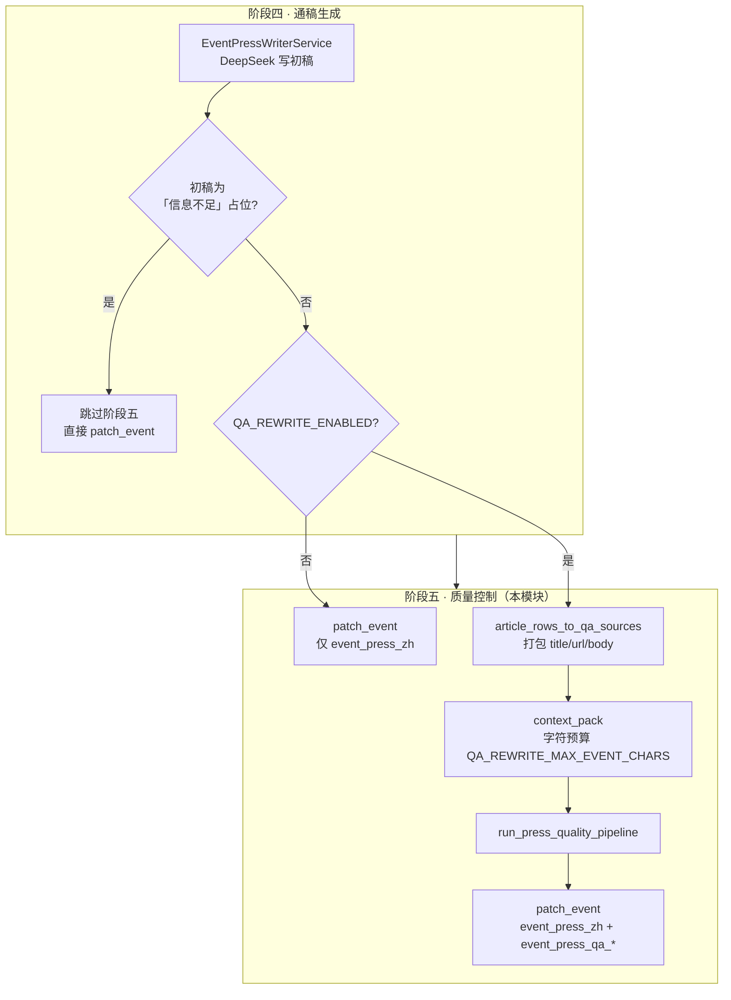
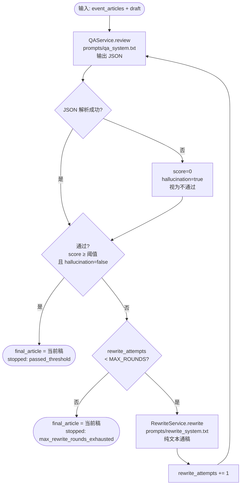

# AI 通稿质量控制（模块 5）流程说明

本文描述 **阶段五：对阶段四生成的 `event_press_zh` 初稿做审稿（QA），未达标则条件重写，终稿仍写回 `events.json`**。实现代码见 `V3/src/services/qa_rewrite/`；编排入口为 `run_press_quality_pipeline`；与阶段四的衔接在 `V3/src/event_press_workflow.py`。配置见 `.env.example` 中 `QA_REWRITE_*`。

> **与「发布前摘要 QA」的区别**：`src/ai.py` 中 `SummaryService.review_summary_for_publish` 面向 **单篇/簇摘要** 的公众号发布门禁，读 `docs/prompts/qa_review_system.md`。本模块面向 **事件通稿**（`event_press_zh`），prompt 在 `src/services/qa_rewrite/prompts/`，二者互不替代。

## 在整条链路中的位置

- **前置**：阶段四 `EventPressWriterService` 已产出通稿初稿（字符串）。
- **触发**：`run_event_press_generation` 在阶段四成功后 **默认自动** 调用阶段五（`QA_REWRITE_ENABLED=true`）；`EVENT_AI_PRESS_ENABLED=false` 时整条阶段四不跑，阶段五也不会执行。
- **素材**：QA / 重写使用的原始稿列表与阶段四 **同源选文**（`article_rows_to_qa_sources`，与 `EVENT_AI_PRESS_SELECTION_MODE` 等一致）。
- **落库**：终稿覆盖 `event_press_zh`；并写入 `event_press_qa_*` 元数据字段。

## 流程图（与阶段四衔接）



## 流程图（阶段五内部循环）



### 通过判定（代码口径）

| 条件 | 说明 |
|------|------|
| `score >= QA_REWRITE_PASS_THRESHOLD` | 默认 **80** |
| `hallucination == false` | 模型标明明显编造时为 `true`，一律不通过 |
| 二者同时满足 | 不再重写，返回当前稿 |

评分语义（prompt 约定）：90+ 接近正式媒体；80+ 可发布；70+ 明显问题；60 以下不建议发布。

## 配置项（`.env`）

| 变量 | 默认 | 含义 |
|------|------|------|
| `QA_REWRITE_ENABLED` | `true` | 阶段四成功后是否自动跑本模块 |
| `QA_REWRITE_PASS_THRESHOLD` | `80` | 通过分数线 |
| `QA_REWRITE_MAX_ROUNDS` | `2` | 未达标时最多重写次数（每次重写后再 QA） |
| `QA_REWRITE_QA_TIMEOUT_SEC` | `120` | 审稿单次 HTTP 超时 |
| `QA_REWRITE_REWRITE_TIMEOUT_SEC` | `180` | 重写单次 HTTP 超时 |
| `QA_REWRITE_MAX_EVENT_CHARS` | `120000` | 原始 event articles 进 prompt 的最大字符 |
| `QA_REWRITE_MAX_RETRIES` | `3` | DeepSeek 传输/5xx/429 重试次数 |
| `QA_REWRITE_RETRY_BACKOFF_SEC` | `1.6` | 重试退避基数（秒） |

## Prompt 文件

| 文件 | 角色 | 模型输出 |
|------|------|----------|
| `src/services/qa_rewrite/prompts/qa_system.txt` | 审稿 system | **仅 JSON**（score、issues、rewrite_suggestions 等） |
| `src/services/qa_rewrite/prompts/rewrite_system.txt` | 重写 system | **仅正文**（600～1000 字中文通稿，无 markdown） |

User 侧内容由代码拼装：原始稿块 + 当前通稿；重写时额外注入上一轮 QA JSON。

## 落库字段（`events.json`）

| 字段 | 说明 |
|------|------|
| `event_press_zh` | 终稿（可能经 0～N 次重写） |
| `event_press_generated_at` | 阶段四完成时间（阶段五不单独改此字段） |
| `event_press_qa_score` | 最后一轮 QA 分数 |
| `event_press_qa_approved` | 模型 JSON 中的 `approved` |
| `event_press_qa_hallucination` | 是否判定编造 |
| `event_press_qa_rewrite_attempts` | 实际重写次数 |
| `event_press_qa_stopped_reason` | 如 `passed_threshold` / `max_rewrite_rounds_exhausted` |
| `event_press_qa_at` | 阶段五完成 UTC 时间戳 |

## 本地验证

**阶段四 + 五串联（北京 fixture，推荐）**

```bash
cd V3
export PYTHONPATH=.
# V3/.env 或 V1/.env 中配置 DEEPSEEK_API_KEY
python tests/integration/run_event_press_fixture.py
```

日志中应出现 `qa_review_completed`、`event_press_qa_done`；标准输出含 `qa_score` / `rewrites` / `stop=`。

**仅阶段五 MVP（stub 素材）**

```bash
cd V3
export PYTHONPATH=.
python tests/integration/run_qa_rewrite_mvp.py          # 调 DeepSeek
python tests/integration/run_qa_rewrite_mvp.py --dry-run  # 仅打包/JSON 解析
```

**单元测试（mock，不调 API）**

```bash
PYTHONPATH=. python -m pytest tests/test_event_press_qa_chain.py tests/test_qa_rewrite_json.py -q
```

## 相关文档

- [AI事件通稿生成模块流程.md](./AI事件通稿生成模块流程.md)（阶段四）
- [事件搜索增强模块流程.md](./事件搜索增强模块流程.md)（阶段一～三总览）
