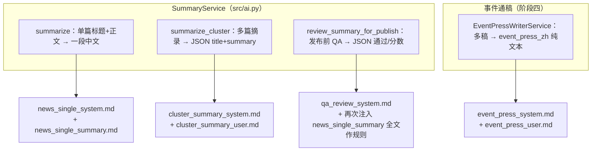

# 新闻与摘要 Prompt 目录（可迭代维护）

本目录集中存放 **V3 中文新闻稿 / 摘要** 相关的大模型提示词（Markdown）。代码在运行时读取对应文件；**改稿只改本目录下的 `.md`**，无需改 Python 字符串常量。

## 和整体流程的关系（先读这段）

这些文件**不是**「跑 pipeline 的必经步骤清单」，而是：**每当代码要调一次大模型写中文或审中文时，从磁盘读一段说明给模型看**。没有它们，程序会用内置兜底字符串，但风格与禁令不可控。

下面按 **「代码入口 → 读哪些 md」** 对应（与 `run_once` 里是否开摘要/通稿/QA 开关有关，不是每一步都跑全）：

**为何看起来「很多」？** 因为 V3 里至少有 **四条互不相同的 LLM 调用形态**（单篇、簇 JSON、QA、事件通稿），每条要传的 **system / user 结构、占位符、输出格式** 不一样，拆成多文件是为了：**改通稿不动簇摘要的 JSON 约束，改 QA 不动通稿的纯文本约束**。

**一定需要这么多吗？** **不必须。** 这是可维护性上的拆分。若你愿意接受「一处改动可能影响多条链路」，可以合并（例如：两个极短的 `*_system.md` 合成一个 `shared_system.md`，由代码按场景取首行；或把单篇体例与通稿 system 合成一份长文再在代码里切片）。当前拆法是为了迭代时**影响面可控**。

## 文件一览

| 文件 | 用途 | 占位符 / 说明 |
|------|------|----------------|
| `news_single_system.md` | 单篇摘要等调用的 **system** 短句 | 无 |
| `news_single_summary.md` | 单篇摘要 **user** 体例长文（含材料前的写作规范） | `{{MAX_CHARS}}` |
| `cluster_summary_system.md` | 多源簇摘要 JSON 调用的 **system** | 无 |
| `cluster_summary_user.md` | 多源簇摘要 **user** 模板 | `{{MAX_CHARS}}`、`{{MIN_CHARS}}`、`{{BUNDLE}}` |
| `event_press_system.md` | 事件通稿 `event_press_zh` 的 **system** | 无 |
| `event_press_user.md` | 事件通稿 **user** 模板 | `{event_title}`、`{keywords}`、`{articles}`（Python `str.format`） |
| `qa_review_system.md` | 发布前摘要 QA 的 **system** 短句 | 无 |

**事件通稿 QA / 重写（模块 5）** 的 prompt 不在本目录，而在 `src/services/qa_rewrite/prompts/`（`qa_system.txt`、`rewrite_system.txt`）；流程见 [AI通稿质量控制模块流程.md](../AI通稿质量控制模块流程.md)。

## 代码入口

- `src/utils/prompt_load.py`：`load_prompt_file(stem)`
- `src/ai.py`：`SummaryService` 加载单篇体例、簇摘要、单篇 system、QA system
- `src/services/ai_press_writer/prompt_builder.py`：事件通稿 system + user 模板

## 与旧路径的关系

- 根目录 `docs/summary_prompt.md` 仅保留**跳转说明**，不再作为加载源，避免两处各改各的。

## 批量调用与 token

- **事件通稿**：`EventPressWriterService` 在构造时加载一次 `event_press_system` 与 `event_press_user` 模板；`run_event_press_generation` 对多个 `event_id` 循环时复用同一实例，每次请求仅替换 **user** 中的标题/关键词/文章块；**system** 保持同一字符串引用。
- DeepSeek 是否对重复 `system` 前缀计费减免以官方说明为准；该写法的主要收益是：**不重复读盘**、**结构清晰**、**风格稳定**。

## 迭代约定

1. 改语气、禁令、字数区间：优先改 **system + 体例** 对应的 md，再跑集成或 fixture 目检。
2. 新增占位符时：同步改 `prompt_builder.format_event_press_user` / `build_user_prompt` 或 `ai.py` 中的拼装逻辑，并在上表登记。
3. 事件通稿 user 模板中的 `{articles}` 由 `format_articles_block` 生成，勿在 md 内手写大段样例（以免与真实格式分叉）。
