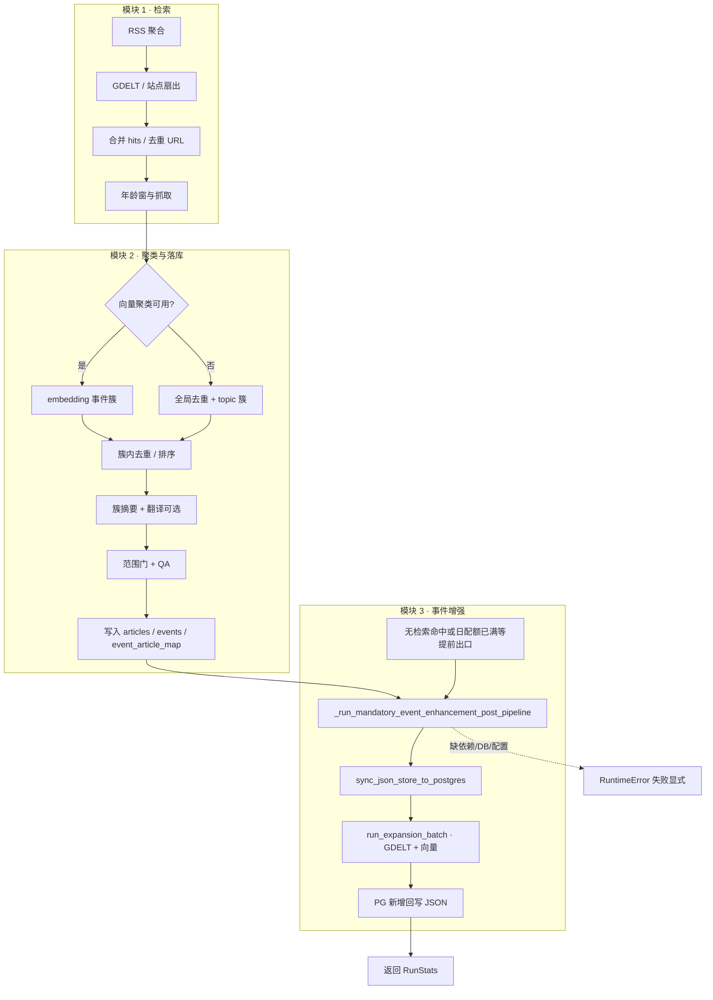

# 事件搜索增强（模块 1→3）流程说明

本文描述 **检索（模块 1）→ 聚类与落库 JSON（模块 2）→ 事件增强与 PG（模块 3）** 的串联关系；表字段与 JSON 映射见 [数据库结构_事件增强.md](./数据库结构_事件增强.md)，入库与聚类细节见 [入库与事件聚类流程.md](./入库与事件聚类流程.md)。

## 简要说明

1. **模块 1（检索）**：RSS 聚合 + GDELT（站点优先或主题双语）合并候选 URL，经年龄窗、去重与抓取后进入下游。
2. **模块 2（聚类 / 成稿）**：对当批正文做向量聚类或回退规则聚类，簇摘要、门禁与 QA 通过后写入 `articles.json`、`events.json`、`event_article_map.json`。
3. **模块 3（事件增强）**：每次 `run_once` **无论本轮是否命中稿件、是否因日配额跳过微信推送**，都会在出口前执行：JSON → PostgreSQL 同步 → `event_enhancement`（GDELT 扩搜、向量门槛、写 PG）→ 将 PG 新增关联回写 JSON。

必选配置：`EVENT_ENHANCEMENT_DATABASE_URL`、`event_enhancement/config/expansion.yaml`（或通过 `EVENT_ENHANCEMENT_CONFIG_PATH` 覆盖），并完成 Alembic 迁移。依赖缺失或配置不全时 `run_once` 会显式失败，不再静默跳过阶段三。

## 流程图（Mermaid）

## 实现锚点（代码）

| 环节 | 位置 |
|------|------|
| `run_once` 主链路 | `V3/src/pipeline.py` → `PipelineRunner.run_once` |
| 必选阶段三入口 | `PipelineRunner._run_mandatory_event_enhancement_post_pipeline` |
| JSON ↔ PG 与扩批 | `V3/src/event_enhancement_workflow.py` |

## 用历史聚类 fixture 测阶段三（不跑检索）

集成脚本 **`tests/integration/run_event_enhancement_fixture.py`**：

- 默认读取 **`tests/data/dedupe_runs/beijing`**（北京无人机同题向量聚类落库样例）；
- 复制到可写 **`tests/data/event_enhancement_runs/last_fixture_run`**（可用 `--work-dir` 改），**不修改**仓库内原始 fixture；
- 按 **`event_article_map.json`** 为缺失 URL 追加占位 `articles.json` 行（与 `run_embedding_urls_ingest` 只落代表稿时的结构对齐），并把 **`created_at`** 拨到当前时间，保证仍落在 `expansion.yaml` 的 **`expansion_ranking_window_hours`** 内；
- 随后调用与 `run_once` 相同的 **`run_event_enhancement_post_pipeline`**：**`EVENT_ENHANCEMENT_DATABASE_URL` 留空 = JSON 模式**（无须 PG，结果 `<DATA_DIR>/event_enhancement_last_run.json`）；**填写 URL = PG 模式**（须迁移）。

本地校验 hydrate 逻辑（无网络）：`pytest tests/test_event_enhancement_hydrate.py`。

口径与「每事件最多几篇、是否删历史」见 **[事件增强测试与容量说明.md](./事件增强测试与容量说明.md)**。

**阶段四（AI 事件通稿）** 的流程图与 fixture 测法见 **[AI事件通稿生成模块流程.md](./AI事件通稿生成模块流程.md)**；集成脚本 **`tests/integration/run_event_press_fixture.py`**（需 `DEEPSEEK_API_KEY`）。

**阶段五（通稿质量控制）** 在阶段四成功后默认自动执行（QA → 未达标则重写）；流程图与配置见 **[AI通稿质量控制模块流程.md](./AI通稿质量控制模块流程.md)**。

## 与「仅检索脚本」的区别

`tests/integration/run_search_flow.py` 等脚本通常只验证模块 1（或加上离线向量去重），**不**启动完整 `run_once`。``run_once`` 末尾阶段三在 **JSON 模式**下不要求 PostgreSQL；配 PG URL 时仍可走原同步与扩搜。
