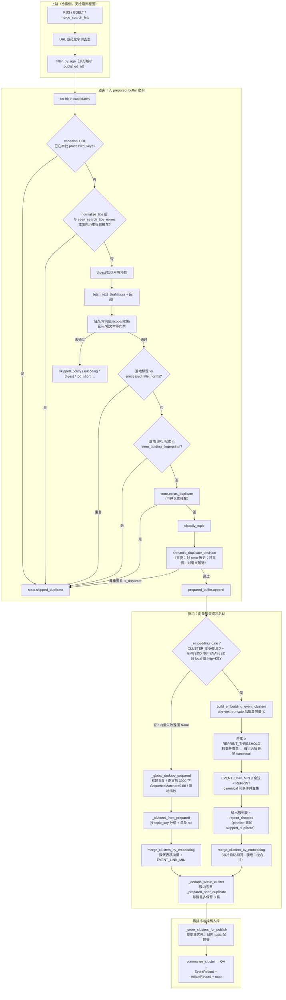

# V3：入库与事件聚类（概要）

本文衔接 [检索模块流程图](./检索模块流程图.md)：检索合并、时间窗过滤之后的 **pipeline** 阶段（`PipelineRunner.run_once`）。

## 正文抽取

- 落地页 HTML 经 `decode_http_html_bytes` 解码后，**优先**使用 [trafilatura](https://trafilatura.readthedocs.io/) 抽取主文；长度低于 `TRAFILATURA_MIN_CHARS` 或抽取失败时，**回退**为原 BeautifulSoup 段落拼接逻辑。
- 依赖见根目录 `requirements.txt`（`trafilatura`、`charset-normalizer`；若 `lxml` 6+ 需 `lxml_html_clean`）。

## 去重与聚类完整流程图

下图覆盖 **单条入批前** 与 **`prepared_buffer` 填满之后** 的两段去重，以及 **向量转载 / 同事件聚类** 与 **冷启动回退**。环境变量见 `src/config.py` / `.env.example`（`EMBEDDING_*`、`CLUSTER_MERGE_HOURS` 等）。

### 图例与实现对应

| 阶段 | 源码位置 |
|------|----------|
| 转载并查集 / 事件并查集 | `src/ingest_cluster.py`：`build_embedding_event_clusters` |
| 向量请求与余弦 | `src/embed_dedupe.py`：`fetch_embeddings_batch`、`cosine_similarity` |
| 冷启动全局去重、按 topic 成簇、簇级向量合并、簇内去重、排序 | `src/pipeline.py`：`_global_dedupe_prepared`、`_clusters_from_prepared`、`_dedupe_within_cluster`、`_order_clusters_for_publish`；`src/ingest_cluster.py`：`merge_clusters_by_embedding` |
| `run_once` 中分支与统计 | `src/pipeline.py`：`emb_clusters = await build_embedding_event_clusters(...)` 一段 |

**冷启动与向量路径的差异**：冷启动先 `_clusters_from_prepared`（按 `topic_key` 分组），再与向量路径一样在批末调用 `merge_clusters_by_embedding`（`EMBEDDING_ENABLED=true` 时）：对各簇代表稿做余弦并查集，阈值 `EMBEDDING_EVENT_LINK_MIN`，时间窗 `CLUSTER_MERGE_HOURS`。

## 配置与开关（摘要）

- **`EMBEDDING_BACKEND=local`（默认，免 KEY）**：本机 `sentence-transformers` 加载 `EMBEDDING_MODEL`（默认 **`BAAI/bge-m3`**）；首次运行需联网拉权重，之后走缓存。
- **`EMBEDDING_BACKEND=http`**：OpenAI 兼容 `POST /v1/embeddings`，需 **`EMBEDDING_API_KEY`**。
- **`EMBEDDING_CLUSTER_ENABLED=true`** 且 **`EMBEDDING_ENABLED=true`** 且 gate 通过时：走图中 **向量** 分支（转载阈值 `EMBEDDING_REPRINT_THRESHOLD`，事件连边下限 `EMBEDDING_EVENT_LINK_MIN`）。
- 否则：走 **冷启动** 分支（`_global_dedupe_prepared` + `_clusters_from_prepared`）。

## 事件落库与翻译

- 每篇成功摘要（过门禁）写入 **`data/events.json`**（`EventRecord`：成稿标题、摘要原文、`summary_zh` 等）及 **`data/event_article_map.json`**（`event_id`、各来源 URL、`primary`/`source` 角色）。
- `articles.json` 中对应行增加 `event_id`、`summary_zh`（与微信/抽检展示一致时：摘要可为中译结果）。
- `EVENT_TRANSLATE_SUMMARY_ENABLED=true` 时，若成稿 **CJK 占比很低**，则仅对 **事件级标题+摘要** 调用 DeepSeek 中译，不对全文 article 翻译。

## 阶段三：事件增强（必选，`run_once` 末尾）

在 **`run_once`** 完成「成稿 → `articles.json` / `events.json` / `event_article_map.json`」之后，**始终**执行阶段三（配置或依赖缺失时 **整轮 `run_once` 失败**，不再静默跳过）：

1. **JSON → PostgreSQL**：同步事件与带 `event_id` 的稿件（字段与表结构见 [`数据库结构_事件增强.md`](数据库结构_事件增强.md)）。
2. **扩搜**：调用仓库根目录 [`event_enhancement`](../../event_enhancement/) 包内 `run_expansion_batch`（GDELT + bge-m3 + FAISS 门槛，`config/expansion.yaml`）。
3. **PG → JSON 回写**：将 PG 中 **URL 尚不在 JSON** 的补充稿追加进 `articles.json` 与 `event_article_map.json`。

**环境**：在 V3 运行目录 `.env` 中配置 **`EVENT_ENHANCEMENT_DATABASE_URL`**（`postgresql+asyncpg://...`），并完成上述文档中的 **Alembic 迁移**。

实现入口：[`src/event_enhancement_workflow.py`](../src/event_enhancement_workflow.py)；由 [`src/pipeline.py`](../src/pipeline.py) `run_once` 在 `return stats` 前调用。

## 相关源码与集成测试

- `tests/integration/run_saved_search_dedupe_report.py` — 对已保存的 `tests/data/search/test_search_results.json`（由 `run_search_flow` 生成）拉全文并输出 `tests/data/search/dedupe_report_from_saved_search.json`（向量聚类 + `offline_batch_preview`）；衔接验证见 `tests/integration/verify_search_dedupe_chain.py`
- `src/utils/article_extract.py` — trafilatura 封装  
- `src/utils/http_decode.py` — HTML 字节解码  
- `src/ingest_cluster.py` — 向量转载 + 事件并查集  
- `src/embed_dedupe.py` — `fetch_embeddings_batch`（`local` / `http`）
- `src/pipeline.py` — `_fetch_text`、`run_once` 衔接  
- `src/storage.py` — `EventRecord`、`JsonStore.append_event*`  
- `src/ai.py` — `translate_title_summary_to_zh`
