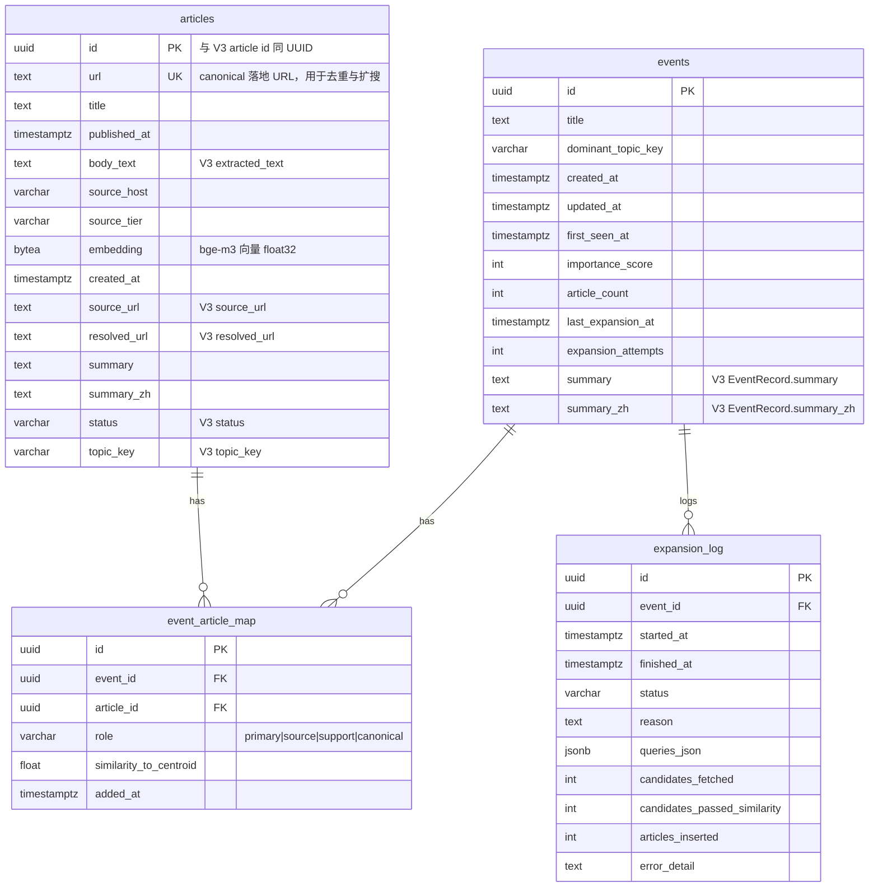

# 事件增强 — PostgreSQL 数据库结构

本文描述 **阶段三（事件增强）** 使用的 PostgreSQL 表，及其与 V3 JSON 落库（`ArticleRecord` / `EventRecord` / `event_article_map`）的对应关系。迁移脚本位于 [`event_enhancement/alembic/versions/`](../event_enhancement/alembic/versions/)。

## ER 关系（概念）



## 表说明

| 表 | 用途 |
|----|------|
| **events** | 事件主档；`importance_score` / `article_count` 由扩搜前刷新；`summary`/`summary_zh` 与 `events.json` 对齐（迁移 002）。 |
| **articles** | 稿件全文与向量；`url` 唯一；`source_url`/`resolved_url`/`summary`/`status`/`topic_key` 与 `articles.json` 对齐（迁移 002）。 |
| **event_article_map** | 事件与稿件多对多；`role` 沿用 V3 的 `primary`/`source`，扩搜写入多为 `support`。 |
| **expansion_log** | 每轮扩搜审计：查询列表、候选数、过相似度数、入库数、错误摘要。 |

## 与 `run_once` 的数据流

1. **JSON → PG**：[`V3/src/event_enhancement_workflow.py`](../src/event_enhancement_workflow.py) 中 `sync_json_store_to_postgres` 按上表字段 upsert。  
2. **扩搜写 PG**：`event_enhancement.pipeline.expansion` 写入新 `articles` + `event_article_map`，并更新 `expansion_log` / `events.last_expansion_at` 等。  
3. **PG → JSON**：`merge_postgres_articles_into_json` 将 **PG 中 `url` 尚未出现在 JSON** 的稿件追加回 `articles.json` 与 `event_article_map.json`。

## 迁移命令（Alembic）

在 `event_enhancement` 目录，使用**同步** DSN（去掉 `+asyncpg`）：

```bash
export DATABASE_URL="postgresql://用户:密码@127.0.0.1:5433/库名"
alembic upgrade head
```

应用侧（V3）使用 **`postgresql+asyncpg://...`** 的 `EVENT_ENHANCEMENT_DATABASE_URL`。

## 必选配置

`run_once` 每次在成稿落 JSON 后执行阶段三。**已配置** `EVENT_ENHANCEMENT_DATABASE_URL` 时：走 **PG 模式**（须迁移 + `expansion.yaml`）。**未配置** URL 时：走 **JSON 模式**（只读写 `articles.json` / `event_article_map.json`，见 `event_enhancement_json.py`），不要求 PostgreSQL。
