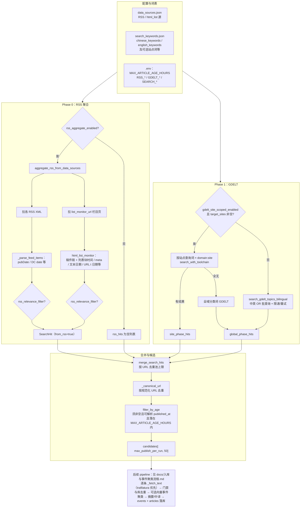

# V3 检索模块流程图

本文描述 **`run_once` 检索阶段**（从配置到进入 `PipelineRunner` 逐条处理之前）的数据流，与代码实现一致。

**时间窗与发布时间**：合并去重后使用 `filter_by_age(candidates, MAX_ARTICLE_AGE_HOURS)`。`published_at` 为空、仅空白、或无法解析为时间的 `SearchHit` **一律不进入候选**；`max_hours <= 0` 时不做小时比较，但仍须可解析的 `published_at`。

**主要代码入口**：`src/pipeline.py` → `PipelineRunner.run_once`（检索段）；`src/search.py` → `filter_by_age`、`merge_search_hits`；`src/rss_aggregate.py`；`src/search.py` → `search_gdelt_topics_bilingual` 或 `search_with_toolchain`（站点扇出模式）。

---

---

*文档版本：与 V3 检索逻辑同步；若 `run_once` 分支有调整，请一并更新本图。*
