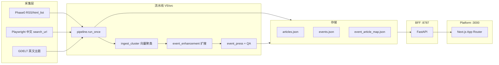

# V5 产品需求文档（PRD）

> **版本**：V5（MVP 闭环）  
> **基线**：V4 全链路 + Event Graph Memory  
> **状态**：本机可运行；前后端 API 验收通过（2026-06-07）  
> **关联**：根目录 [`项目PRD/product_definition_brief.md`](../../项目PRD/product_definition_brief.md)

---

## 1. 背景与问题

运营低空经济/无人机领域公众号时，人工难以在 **14 小时发布窗口** 内覆盖中英文权威源、快讯与政策稿，更难以对多源信息做 **去重聚类、扩搜补证、成稿、QA、草稿推送** 的一体化闭环。

V5 在 V4「事件优先」流水线之上，补齐 **可演示的产品闭环**：平台可操作、中文检索升级、反馈驱动策略、事件地图/记忆 MVP，以及 Prompt 可编辑可验证。

---

## 2. 产品定位

**Event Intelligence Platform（事件情报工作台）**：面向编辑/运营的单租户系统，自动采集 → 事件聚类 → 通稿生成 → 质量门禁 → 微信公众号草稿箱，并在平台内完成审核、配置与策略迭代。

| 维度 | V5 口径 |
|------|---------|
| 领域 | 低空经济、无人机、eVTOL、UAM、国内政策与产业动态 |
| 发布节奏 | 默认定时 2 次/日（`schedule_jobs.json` 可配） |
| 质量原则 | 无稿不发；战争/离题/拼盘快讯 hard fail；QA≥70 可推送 |
| 成本原则 | 中文 Playwright **仅三词 × 各站 search_url**（不爬全站列表） |

---

## 3. 用户与场景

| 角色 | 场景 |
|------|------|
| 编辑/运营（当前 1–3 人） | 早/晚查看 Dashboard → 筛选「可推送」事件 → 详情页改通稿 → 推草稿箱 |
| 配置管理员 | 设置页维护数据源、检索词、定时、Prompt Contract、反馈策略 |
| 开发者/面试演示 | `run-once` 或平台「开始采集」→ 日志 + 前端可视化验收 |

**非目标（V5）**：多租户权限体系、移动端推送、全自动无人工发布。

---

## 4. 系统架构



| 组件 | 路径 | 端口 |
|------|------|------|
| 流水线 CLI | `V5/src/main.py` | — |
| BFF | `V5/src/bff/app.py` | 8787 |
| 前端 | `platform/`（仓库根，代理 V5 BFF） | 3000 |
| 扩搜配置 | `event_enhancement/config/expansion.yaml` | — |

---

## 5. 功能需求（按阶段）

### 5.1 阶段 0：检索

| ID | 需求 | 实现 | 验收 |
|----|------|------|------|
| R-01 | 专业站点 RSS + html_list | `rss_aggregate.py` + `data_sources.json` | 英文/部分中文 HTTP 抓取 |
| R-02 | 中文 Playwright 三词搜索 | `browser_zh_search.py` + `browser_zh_sources.json` + `browser_zh_keywords.json` | 18 次 page/轮；主路径命中≥20 则跳过中文 html/rss |
| R-03 | 英文 GDELT 主题检索 | `search.py` 串行 + `gdelt/http_core` 限速缓存 | 日志 `gdelt serial done` |
| R-04 | 发布时间硬门禁 | `filter_by_age` + 落地页 backfill | 超 `MAX_ARTICLE_AGE_HOURS` 不入库 |
| R-05 | 检索预过滤（英文） | `topic_prefilter.py` | 抓正文前丢弃弱相关 |

**中文 Playwright 规则（R-02）**：

- 词表：`无人机`、`低空经济`、`eVTOL`（与 RSS 词表分离）
- URL 模板使用 `{query}` **占位符**（含花括号）；运行时 `quote` 后整段替换，**不可**直接粘贴到浏览器
- **禁止** list_url / 电报流 / 首页全量爬取（Playwright 成本）

文档：[`中文站Playwright检索.md`](./中文站Playwright检索.md)

### 5.2 阶段 1：入库与聚类

| ID | 需求 | 实现 | 验收 |
|----|------|------|------|
| I-01 | 正文抽取 | trafilatura + 回退 | `article_extract.py` |
| I-02 | URL/标题/向量去重 | `storage` + `ingest_cluster` | `skipped_duplicate` 统计 |
| I-03 | 同题累增 | `event_accumulate.py` | 库内同题不入新 event |
| I-04 | 向量聚类 | bge-m3 本地 / HTTP | `EMBEDDING_CLUSTER_ENABLED` |
| I-05 | 中文 LLM 入库（可选） | `zh_ingest/` | `ZH_INGEST_LLM_ENABLED=true` 时跳过 prefilter/字数门槛，单篇门禁 + 簇级事件提炼 |

文档：[`入库与事件聚类流程.md`](./入库与事件聚类流程.md)、[`中文入库LLM流程.md`](./中文入库LLM流程.md)

### 5.3 阶段 2：摘要与发布选簇

| ID | 需求 | 实现 | 验收 |
|----|------|------|------|
| S-01 | importance Top N 摘要 | `cluster_importance` + `WECHAT_PUBLISH_TOP_N` | 默认 Top3 |
| S-02 | 推送冷却 | `WECHAT_PUBLISH_COOLDOWN_DAYS` | 同 topic 近期不重复推 |
| S-03 | 摘要字数下限 | `CLUSTER_SUMMARY_MIN_CHARS`（800） | `skipped_too_short` |
| S-04 | 日配额按事件计 | `count_wechat_draft_pushed_events_on_local_date` | 自然日封顶 |

### 5.4 阶段 3：事件增强（扩搜）

| ID | 需求 | 实现 | 验收 |
|----|------|------|------|
| E-01 | run_once 末尾必选 | `_run_mandatory_event_enhancement_post_pipeline` | 无候选也执行 |
| E-02 | 语言路由 | 中文事件跳过 GDELT；英文 GDELT→RSS→DDGS | `lang_detect` |
| E-03 | 相似度入库 | sim≥0.7 写入 `articles.json` | `event_enhancement_last_run.json` |
| E-04 | JSON / PG 双模式 | `EVENT_ENHANCEMENT_DATABASE_URL` 空则 JSON | 本机默认 JSON |

文档：[`事件搜索增强模块流程.md`](./事件搜索增强模块流程.md)

### 5.5 阶段 4–5：通稿与 QA

| ID | 需求 | 实现 | 验收 |
|----|------|------|------|
| P-01 | 事件通稿 | `event_press_workflow` + DeepSeek | `event_press_zh` 字段 |
| P-02 | QA + 条件重写 | `qa_rewrite/` | score、rewrite 轮次落库 |
| P-03 | Prompt 外置 | `docs/prompts/*.md` + `prompt_load.py` | 与生成/QA 同源 |
| P-04 | Prompt Contract | `prompt_contract_mvp` + BFF PUT | 设置页 Prompts 标签可编辑 |
| P-05 | hard/soft 规则注入 | QA/Rewrite 输入注入 | `feedback_policy_overrides.json` 可读 |

文档：[`AI事件通稿生成模块流程.md`](./AI事件通稿生成模块流程.md)、[`AI通稿质量控制模块流程.md`](./AI通稿质量控制模块流程.md)

### 5.6 阶段 6：微信公众号

| ID | 需求 | 实现 | 验收 |
|----|------|------|------|
| W-01 | 草稿箱 draft/add | `wechat.py` | 需 IP 白名单 + 封面图 |
| W-02 | run-once 可选自动推 | `RUN_ONCE_PUSH_TO_WECHAT` | 默认建议 false 待抽检 |
| W-03 | 补推命令 | `push-today-drafts` | 同日 QA 复核 |
| W-04 | 推送后清空正文 | `STRIP_EXTRACTED_TEXT_AFTER_WECHAT_DRAFT` | 减 JSON 体积 |

### 5.7 V5 MVP 闭环（BFF + 前端）

| ID | 能力 | API | 前端入口 |
|----|------|-----|----------|
| M-01 | 事件地图 | `GET /api/events/{id}/map` | 事件详情 |
| M-02 | 事件记忆 | `GET/POST .../memory` | 事件详情 |
| M-03 | 历史关联链 | `GET /api/events/{id}/history` | 事件详情 |
| M-04 | 用户反馈 | `POST /api/feedback` | 事件详情 |
| M-05 | 反馈汇总 | `GET /api/feedback/summary` | 设置页 |
| M-06 | 反馈策略（安全） | recompute / apply / rollback | 设置页「反馈策略闭环」 |
| M-07 | 候选源发现 | `POST /api/sources/discover` | 设置页 |
| M-08 | 源探测 | `POST .../candidates/{host}/probe` | 设置页 |
| M-09 | 数据源健康 | health scan / acknowledge | 设置页告警条 |
| M-10 | 手动采集 | `POST /api/pipeline/run-once` | Dashboard / 顶栏 |
| M-11 | Event Graph | pipeline 内置 | 快照 `data/event_graph/` |

### 5.8 平台页面

| 路由 | 功能 |
|------|------|
| `/` | Dashboard：指标、topic 趋势、开始采集 |
| `/events` | 事件列表：importance、tags（可推送/待扩搜）、分页 |
| `/events/[id]` | 通稿编辑、QA、溯源、参考稿、地图/记忆/反馈/历史链 |
| `/search` | 已入库事件检索 |
| `/qa` | 通稿 QA 复核列表 |
| `/settings` | 数据源、关键词、定时、Prompts、反馈策略、候选源 |

---

## 6. 数据与配置

| 文件 | 用途 |
|------|------|
| `data/articles.json` | 文章库 |
| `data/events.json` | 事件库（含通稿、QA 字段） |
| `data/event_article_map.json` | 事件–稿件关系 |
| `data/event_enhancement_last_run.json` | 最近扩搜 trace |
| `data/feedback_events.json` | 用户反馈 |
| `data/source_candidates.json` | 候选数据源 |
| `data/prompt_contract.json` | Prompt Contract 持久化 |
| `config/feedback_policy_overrides.json` | 反馈应用后的 QA/检索 override |
| `data/demo/` | 可提交 demo 样本 |

环境变量完整说明：`V5/.env.example`。

---

## 7. 非功能需求

| 类别 | 要求 |
|------|------|
| 运行时 | Python 3.11+；`miniconda3` 推荐；Playwright 需 `playwright install chromium` |
| 模型 | DeepSeek API（通稿/QA/中文 LLM 门禁）；bge-m3 本地向量 |
| 日志 | `data/pipeline_run.log`、`scheduler_run.log`、BFF stdout |
| 测试 | `PYTHONPATH=. pytest tests/ -q`；`scripts/platform_frontend_e2e.py` |
| 安全 | `.env` 不入库；微信 AppSecret 轮换；反馈策略 apply 需确认 token + 备份 |

---

## 8. 验收标准（V5 封板）

### 8.1 后端流水线

```bash
cd V5
export PYTHONPATH=.
export BROWSER_ZH_SEARCH_ENABLED=true
export ZH_INGEST_LLM_ENABLED=true
export RUN_ONCE_PUSH_TO_WECHAT=false
python -m src.main run-once
# 期望：exit 0；日志含 browser_zh → 聚类 → event_enhancement → press/QA
```

**2026-06-07 实测**（`data/run_once_zh_e2e_20260607T140713Z.log`）：

- Playwright：18 page_opens，68 hits，zh primary 跳过 html/rss
- 扩搜：新事件 inserted=3；历史事件 DDGS fetched=39
- 通稿 QA：rewrite 1 轮后 score=85 passed
- 终态：`failed=0 exit=0`

### 8.2 BFF + 前端

```bash
# 终端 1
cd V5 && PYTHONPATH=. python -m src.main run-bff

# 终端 2
cd platform && BFF_BASE_URL=http://127.0.0.1:8787 npm run dev

# 验收
cd V5 && python scripts/platform_frontend_e2e.py --skip-mutations
```

**2026-06-07 实测**：BFF `/health` 200；Platform `/api/health` connected；**16/16 API 通过**。

### 8.3 单元测试

`pytest tests/`：**152 passed**（3 项为环境/路径相关历史用例，不阻塞主链路）。

---

## 9. 已知限制

| 项 | 说明 |
|----|------|
| 微信 IP 白名单 | 未配置时 `40164`，推送失败但入库/通稿正常 |
| 36kr Playwright 搜索 | 搜索页偶发空 DOM；36kr 依赖 html_list 回退（primary 不足时） |
| 中文搜索质量 | 「无人机」易命中战争快讯，LLM 门禁会大量拒绝（符合策略） |
| 单租户 | 无登录/权限；多人协作靠共享实例 |
| PG 模式 | 可选；默认 JSON 扩搜已满足演示 |
| 反馈策略 | apply 改配置，需人工确认，避免自动震荡 |

---

## 10. V6 迭代方向

> V6 目标：**从「可演示 MVP」到「可持续运营的 production + 产品 brief 中的 OKR」**。

### 10.1 P0 — 中文采集质量与成本

| 方向 | 内容 |
|------|------|
| 36kr / 界面搜索稳定性 | 反爬策略（UA、等待、重试）；或站点级 fallback 策略配置化 |
| 搜索词与结果相关性 | browser 阶段可选「标题含关键词」轻过滤，减少虎嗅泛搜索结果 |
| 中文事件命中率 | 调 `MAX_ARTICLE_AGE_HOURS`、财联社 search 权重；快讯类单独策略（HTTP 电报，不用 Playwright） |
| 配置持久化 | `.env` 默认写入 `BROWSER_ZH_*` + `ZH_INGEST_LLM_*` 生产模板 |

### 10.2 P0 — 扩搜与通稿质量

| 方向 | 内容 |
|------|------|
| GDELT query 截断 | 英文事件名截断 + 非法字符清洗（避免 429 / illegal character） |
| DDGS 噪声 | 扩搜结果域名 blocklist + 相似度上调；减少「词典/旅游」误入库 |
| 通稿 grounding | 加强 `〔n〕` 锚点抽检；QA hard_rules 与编辑反馈联动 |

### 10.3 P1 — 产品 brief 对齐

| 方向 | 内容 |
|------|------|
| 移动端提醒 | 飞书/企业微信 webhook：每日候选 URL + 摘要推送（brief OKR1） |
| 多用户与权限 | admin / editor 角色；审核与发布操作审计（brief OKR2） |
| 数据源审批流 | 候选源 discover → 人工确认 → 写入 `data_sources.json`（brief OKR3） |

### 10.4 P1 — 反馈闭环深化

| 方向 | 内容 |
|------|------|
| 反馈 → 策略 | 扩充分类到检索词/Prompt 片段建议；A/B 沙箱后再 apply |
| clean-library | 历史库 LLM 复检 + 离题 prune 一键化 |
| 指标看板 | 每轮 run_once：检索命中、门禁拒绝原因、扩搜入库率 |

### 10.5 P2 — 基础设施

| 方向 | 内容 |
|------|------|
| 腾讯云部署 | 轻量机 + `deploy/` 脚本；BFF/platform 常驻；防火墙 22/80 |
| Event Graph PG | 可选 PostgreSQL 生产库；与扩搜 PG 共用或分离 |
| 调度高可用 | scheduler 单实例锁；失败告警 |
| 备份 | `data/` 定时 rsync；反馈/配置纳入版本化 |

### 10.6 P2 — 前端体验

| 方向 | 内容 |
|------|------|
| 采集进度 | run-once 实时日志流 WebSocket |
| 中文源专项页 | Playwright 冒烟结果、每站 hit 数可视化 |
| 面试/演示模式 | 只读 demo 数据一键切换 |

### 10.7 不建议放入 V6 首 sprint

- 全自动无人工发布（质量风险）
- 全站 Playwright 列表爬取（成本与噪声）
- 多模型编排平台（范围过大）

---

## 11. 文档索引

| 文档 | 说明 |
|------|------|
| [`../README.md`](../README.md) | 快速启动 |
| [`检索模块流程图.md`](./检索模块流程图.md) | Phase0 |
| [`入库与事件聚类流程.md`](./入库与事件聚类流程.md) | 去重聚类 |
| [`事件搜索增强模块流程.md`](./事件搜索增强模块流程.md) | 扩搜 |
| [`上线前文章校验标准.md`](./上线前文章校验标准.md) | 发布门禁 |
| [`run_once验收报告_20260607.md`](./run_once验收报告_20260607.md) | 历史验收 |
| [`前端可视化验收记录_20260522.md`](./前端可视化验收记录_20260522.md) | UI 点击验收 |

---

## 12. 修订记录

| 日期 | 说明 |
|------|------|
| 2026-06-07 | 初版：V5 能力全集 + 前后端验收口径 + V6 路线图 |
