# 中文入库 LLM 流程（V5 升级路径）

## 启用

```bash
# V5/.env
BROWSER_ZH_SEARCH_ENABLED=true
ZH_INGEST_LLM_ENABLED=true
ZH_SKIP_LENGTH_GATE=true
DEEPSEEK_API_KEY=sk-...
```

英文源 **不走** 本路径，仍使用原有 `topic_prefilter` + `EN_INGEST_MIN_CHARS=400` + 关键词门禁。

## 流程对比

```mermaid
flowchart TB
  subgraph zh [中文升级路径 ZH_INGEST_LLM_ENABLED]
    A1[检索 browser_zh / html_list / RSS] --> A2[时间窗 + URL去重]
    A2 --> A3[跳过 prefilter 关键词]
    A3 --> A4[抓正文]
    A4 --> A5[跳过 ZH 字数门槛]
    A5 --> A6[LLM 单篇门禁 zh_article_gate]
    A6 --> A7[bge-m3 去重聚类]
    A7 --> A8[LLM 簇级事件提炼 ~20字]
    A8 --> A9[seed event + 扩搜/通稿/QA]
  end

  subgraph en [英文路径 不变]
    B1[检索 + GDELT] --> B2[prefilter 关键词]
    B2 --> B3[抓正文 + 400字门槛]
    B3 --> B4[关键词 scope gate]
    B4 --> B5[bge-m3 聚类]
    B5 --> B6[primary.title seed]
  end
```



## 模块

| 模块 | 路径 | 说明 |
|------|------|------|
| 单篇门禁 | `src/services/zh_ingest/article_gate.py` | 抓正文后 LLM 判题 + 政治/抹黑确定性短路 |
| 簇级提炼 | `src/services/zh_ingest/event_extract.py` | 读全簇文章输出 `event_title_zh` |
| Prompt | `src/services/zh_ingest/prompts/*.md` | 可编辑规则与模板 |

## 单篇门禁输出

```json
{
  "keep": true,
  "is_domain_relevant": true,
  "is_political_sensitive": false,
  "is_anti_china_smear": false,
  "category": "industry",
  "reason": "能源无人机巡检"
}
```

**保留示例**：界面快讯 [三峡集团无人机智能巡检](https://www.jiemian.com/article/14546638.html) — 短正文、标题含「无人机」，不因字数拒绝。

**拒绝示例**：战争冲突、台湾政治、抹黑唱衰、多领域新规拼盘、与低空无关的泛资讯。

## 簇级事件提炼

bge-m3 聚类完成后，对 **含中文源稿件** 的簇调用 `extract_zh_cluster_event`：

- `keep_cluster=false` → 整簇丢弃（离题 embedding 误聚）
- `event_title_zh` → 写入 `events.json` 的 `title` / `title_zh`（12–24 字）

## 配置项

| 变量 | 默认 | 含义 |
|------|------|------|
| `ZH_INGEST_LLM_ENABLED` | false | 总开关 |
| `ZH_SKIP_LENGTH_GATE` | true | 中文不拦截字数 |
| `ZH_LLM_ARTICLE_CONCURRENCY` | 3 | 预留：单篇 LLM 并发 |
| `ZH_LLM_EVENT_EXTRACT_MAX_CHARS` | 24 | 事件句上限 |

## 测试

```bash
cd V5
PYTHONPATH=. python -m pytest tests/test_zh_article_gate.py tests/test_zh_event_extract.py tests/test_zh_ingest_gate.py -q
```

## 与 Playwright 检索的关系

Playwright 负责 **发现链接**；本流程负责 **入库门禁与事件命名**。两者需同时启用：

1. `BROWSER_ZH_SEARCH_ENABLED=true` — 中文站检索
2. `ZH_INGEST_LLM_ENABLED=true` — 中文入库升级

见 [`中文站Playwright检索.md`](中文站Playwright检索.md)。
