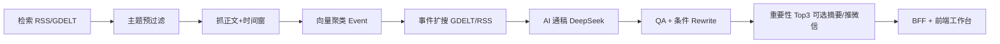

# 低空经济情报平台 — 面试演示视频稿件

> 目标岗位：**AI Workflow Engineer**  
> 演示时长建议：**8–12 分钟**（完整版）；投递/开场用 **[口播稿 · 事件级信息流（推荐）](./面试演示口播稿_V2_WorkflowEngineer.md)**；简历 **[面试简历_项目描述.md](./面试简历_项目描述.md)**；旧版备选 **[可信度版](./面试演示口播稿_3分钟.md)**（易把话题引向 QA）  
> 录屏环境：`platform` http://localhost:3000 + `V3` BFF http://127.0.0.1:8787  
> 可视化点击验收：[前端可视化验收记录_20260522.md](./前端可视化验收记录_20260522.md)

---

## 一、开场（30 秒）

**画面**：平台侧栏 Logo「低空经济情报 · Event Intelligence」

**旁白**：

> 这是一个面向**垂直行业资讯运营**的 AI 工作流系统：从多源采集、事件聚类、AI 通稿生成与 QA，到微信公众号草稿箱发布，全链路可配置、可观测。  
> 前端是面试演示用的**运营工作台**；真正的智能在 Python 流水线里，用 **DeepSeek + 向量聚类 + 规则/模型双层 QA** 串成可复现的 workflow。

---

## 二、需求与产品背景（1.5 分钟）

### 2.1 业务痛点

| 痛点 | 传统做法 | 本系统 |
|------|----------|--------|
| 信息分散 | 人工刷 18+ 站点 / RSS | RSS + 栏目页 + GDELT 主题检索自动入库 |
| 同题多稿 | 标题相似就漏或重复发 | URL 指纹 + 标题 + 正文相似度 + **bge-m3 向量聚类** |
| 写稿慢 | 编辑逐篇改写 | **事件级 AI 通稿**（多源合成，带引用〔n〕） |
| 质量不稳 | 靠人眼抽检 | **QA Agent 打分 + 条件 Rewrite**（未达标可自动重写一轮） |
| 发布摩擦 | 复制粘贴公众号 | 一键 **draft/add** 草稿箱（含封面、HTML 摘要） |

### 2.2 产品定位（一句话）

**「以 Event 为中心的低空经济情报中台」**——不是单篇 CMS，而是：检索命中 → 聚成事件 → 生成通稿 → 质检 → 人工微调 → 推送。

### 2.3 用户角色（演示口径）

- **运营编辑**：看 Dashboard、筛「可推送」事件、改通稿、推草稿  
- **策略配置**：维护数据源 / 中英文关键词 / 定时采集窗口  
- **你（Workflow Engineer）**：设计 prompt、编排阶段、保证每步可测、可回滚

---

## 三、AI Workflow 架构（2 分钟）

**画面**：可穿插仓库内 Mermaid 图（`V3/docs/入库与事件聚类流程.md`、`AI事件通稿生成模块流程.md`）

**旁白要点**（按阶段，对应 run-once）：



1. **阶段一·检索**：`search_keywords.json` 中英词表 + `data_sources.json` 站点；中文源走栏目页监控，英文可走 GDELT（带限速/缓存防 429）。  
2. **阶段二·入库聚类**：`ingest_cluster` + `embed_dedupe`（本地 bge-m3）；同题**累增**到已有 event，不重复建事件。  
3. **阶段三·事件增强**：按事件名扩搜，相似度门槛入库，丰富 reference articles。  
4. **阶段四·通稿**：`ai_press_writer` 读 `docs/prompts/event_press_*.md`，多稿 tier 进 prompt；输出中文通稿 + grounding 段落。  
5. **阶段五·QA**：`qa_rewrite` 另一套 prompt；分数 &lt; 阈值触发 rewrite，结果写入 `event_press_qa_score`。  
6. **发布策略**：`importance` 排序 Top3、3 日 topic 冷却、摘要最低 800 字等——**业务规则与模型分离**，便于调参。

**强调一句（岗位匹配）**：

> 我把「模型调用」收敛到统一服务层，把「阶段顺序、失败重试、并发、落库」放在 pipeline；prompt 全部外置到 `docs/prompts/`，改文案不需要改代码——这是典型的 **AI workflow 可运维** 设计。

---

## 四、现场操作演示脚本（5–7 分钟）

> 录屏前执行：`cd V3 && python scripts/platform_frontend_e2e.py` 确保 API 全绿。  
> 启动：`python -m src.main run-bff` + `cd platform && npm run dev`

### 4.1 Dashboard `/`

| 步骤 | 操作 | 讲解词 |
|------|------|--------|
| 1 | 展示四张指标卡 | 今日新增、QA 均分、Rewrite 次数、事件总数——数据来自真实 `events.json`，不是 mock |
| 2 | 指图表 | 关键词热度 / 国内国际占比 / Top 重要性事件，说明 **importance 打分** 综合稿数、权威源、时效 |
| 3 | 点击 **「开始采集搜索」** | 触发 BFF `POST /api/pipeline/run-once`，后台 subprocess 跑完整流水线；状态轮询 `GET /api/pipeline/status` |
| 4 | （可选）等 completed | 点「刷新列表」→ 说明会自动 invalidate React Query 缓存 |

**注意**：完整 run-once 可能 10–30 分钟；面试可**预先跑完**，现场只点按钮展示「已开始」+ 切到已有数据的 Events。

### 4.2 Events `/events`

| 步骤 | 操作 | 讲解词 |
|------|------|--------|
| 1 | 搜索框输入「无人机」 | 调 `GET /api/events?q=`，服务端过滤标题/摘要 |
| 2 | 切换排序：重要性 / 最新 / QA | 三个 query 参数对应 BFF sort |
| 3 | 拖动「最低重要性」滑块 | `minImportance` 参数 |
| 4 | 点击 Tab：**可推送 / 草稿已推 / 待扩搜** | 纯前端根据 `tags`：通稿+QA≥70 / 已写 `wechat_draft_pushed_at` / 有主稿待扩搜 |
| 5 | 翻页 | 每页 10 条，前端分页 |
| 6 | 点一条进详情 | `GET /api/events/{id}` 返回 intelligence DTO（通稿、grounding、扩搜稿列表） |

### 4.3 事件详情 `/events/[id]`（核心）

| 步骤 | 操作 | 讲解词 |
|------|------|--------|
| 1 | **溯源主稿** 卡片 | 展示入库首篇 seed article，外链可点开核对 |
| 2 | 阅读模式 + 点击 **〔n〕** | 段落级 grounding；右侧抽屉列出扩搜/聚类参考稿 |
| 3 | 点 **编辑** | 人工可改标题与通稿（人机协同，不是 100% 自动发） |
| 4 | **保存通稿** | `PUT /api/events/{id}/press` 写回 `event_press_zh` |
| 5 | **推送草稿箱** | `POST push-draft` → 微信 `draft/add`；演示前确认 IP 白名单，失败则讲清 502 原因 |
| 6 | 或 **标记草稿已推** | 人工已在微信后台录入时用，只打时间戳不调微信 API |
| 7 | 滚动 **参考稿** 列表 | 扩搜稿相似度条——对应阶段三增强 |

### 4.4 Search `/search`

| 步骤 | 操作 | 讲解词 |
|------|------|--------|
| 1 | 输入 `eVTOL` 点搜索 | 在**已入库事件**里全文检索，不是现场爬网 |
| 2 | 说明与「采集配置」词表区别 | 检索页 = 运营查库；GDELT 词表 = 入库管道 |

### 4.5 QA Review `/qa`

| 步骤 | 操作 | 讲解词 |
|------|------|--------|
| 1 | 拖动分数滑块 ≥70 | 前端 filter；列表来自 `GET /api/qa` |
| 2 | 展开 **重写记录** | 展示 QA pipeline 的 rewrite_history（第几轮、原因、after 片段） |
| 3 | 点事件名跳详情 | QA 与通稿同页联动 |

### 4.6 采集配置 `/settings`

| 步骤 | 操作 | 讲解词 |
|------|------|--------|
| 1 | Tab **数据源** | 表格：中文/英文源、栏目页 vs RSS；添加/修改/删除 → `PUT data-sources` |
| 2 | Tab **关键词** | 中英 textarea，一行一词 → 驱动 GDELT/RSS 检索 |
| 3 | Tab **定时任务** | 启用开关、cron 时刻、文章时间窗（小时/天）→ 保存可触发 BFF scheduler |
| 4 | 右上角 **保存配置** | 强调：配置即代码的运维面，不需改 `.env` 也能调采集策略 |

---

## 五、技术亮点（面试追问预备，1 分钟）

1. **Prompt 外置 + Skill**：`V3/docs/prompts/*.md`，改中文体例有 Cursor skill 约束与单测。  
2. **可测试**：`pytest` + `acceptance_smoke.py` + `platform_frontend_e2e.py` 覆盖 BFF 契约与前端每一类按钮。  
3. **失败可观测**：pipeline 分阶段日志；QA `qa_invalid_output` 自动重试；GDELT 独立 httpx client 绕开代理 TLS 问题。  
4. **成本与并发**：`DEEPSEEK_CLUSTER_CONCURRENCY`；推微信时强制串行；扩搜事件级串行防 429。  
5. **V4 演进（可选一句）**：Event Graph Memory（PostgreSQL + NER + 关系演化）——展示你知道如何从 JSON MVP 升级到图数据库。

---

## 六、收尾（30 秒）

**旁白**：

> 这个项目证明我能把 **LLM 能力嵌进可靠的生产 workflow**：有门禁、有回滚、有运营 UI、有验收脚本。  
> 若贵司岗位是 AI Workflow Engineer，我可以从 **prompt/评测集、阶段编排、观测与灰度** 四条线继续加深——今天演示的是已经闭环可跑的一版。

**片尾字幕**：

- 仓库：微信公众号自动化项目 / V3 + platform  
- 本地验收：`python scripts/platform_frontend_e2e.py`  
- 文档：`docs/全流程验收步骤_重要性Top3发布.md`

---

## 七、录屏检查清单

- [ ] BFF `:8787`、Platform `:3000` 已启动  
- [ ] `events.json` 至少有 1 条带通稿、QA 分的事件（方便演示详情页）  
- [ ] 微信 IP 白名单（若要 live 推送）；否则口述 + 用「标记草稿已推」  
- [ ] 浏览器 1440×900，暗色主题已就绪  
- [ ] 关闭通知 / 隐藏书签栏  
- [ ] 预备 3 分钟版：只录 Dashboard → Events 可推送 → 事件详情保存 → QA 页

---

## 八、与 E2E 脚本对应关系

运行：

```bash
cd V3
PYTHONPATH=. python scripts/platform_frontend_e2e.py
```

输出中 **UI → API 对照表** 与本稿件第四节逐步一致；面试前跑通即可声称「每个按钮背后接口已自动化验收」。
