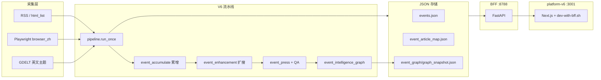

# V6 产品需求文档（PRD）

> **版本**：V6（开发轨 · 产品化闭环）  
> **基线**：V5 全链路 + Event Graph Memory + 平台 MVP  
> **状态**：本机可运行；pytest **176/176**；`run-once` exit=0（不含公众号推送）；BFF `:8788` + platform-v6 `:3001` 已连通  
> **关联**：[`V5/docs/PRD.md`](../../V5/docs/PRD.md)、[`V6全流程测试报告_20260608.md`](./V6全流程测试报告_20260608.md)

---

## 1. 背景与目标

V5 已跑通「检索 → 聚类 → 扩搜 → 通稿 → QA → 草稿箱」生产闭环，但产品化能力仍分散在多个 MVP 碎片（map / memory / history / feedback），数据源接入依赖手改 JSON，运维指标不可见，重复事件与前后端端口易漂移。

**V6 目标**：在 **不影响 V5 生产定时任务** 的前提下，交付可演示、可验收的 **开发轨**：

1. **统一事件图谱**（事件为查询本体，事件—事件关联可视化）
2. **反馈 → Prompt Engineering 闭环**（hard/soft rules，人工 apply + rollback）
3. **数据源健康通知 + 接入向导**（RSS / html_list / browser_zh 三分法）
4. **流水线阶段指标**（`phase_timings` + Dashboard 图表）
5. **入库质量加固**（重复事件累增、列表主稿过滤、中英文 LLM 门禁）
6. **前后端一体化启动**（`npm run dev` 自动拉起 BFF `:8788`）

---

## 2. 双轨策略

| 轨道 | 目录 | BFF | 前端 | 调度 |
|------|------|-----|------|------|
| **生产 / 每日采集** | `V5/` + `platform/` | `:8787` | `:3000` | `run-scheduler` 8:00 / 20:00 |
| **V6 开发** | `V6/` + `platform-v6/` | `:8788` | `:3001` | 默认 **不** 自启 scheduler |

**封板规则**：V5 仅 `.env` 微调与 hotfix；**新功能只在 V6 + platform-v6 开发**。验证通过后 cherry-pick 或择机切生产。

---

## 3. 产品定位

**Event Intelligence Platform V6**：面向编辑/运营的单租户工作台，在 V5 流水线之上增加 **图谱、策略迭代、数据源治理、可观测性**。

| 维度 | V6 口径 |
|------|---------|
| 领域 | 低空经济、无人机、eVTOL、UAM、政策与产业动态 |
| 质量原则 | 无稿不发；战争/离题/拼盘 hard fail；QA≥70 可推送 |
| 中文检索 | Playwright **仅三词 × search_url**（6 站 × 3 词 = 18 次/轮） |
| 列表展示 | 默认 **有主稿或通稿** 的事件才进列表（`V6_EVENT_LIST_REQUIRE_SEED_ARTICLE`） |
| 图谱本体 | **事件节点**；边表示语义/主题/演化关联，非文章节点 |

---

## 4. 系统架构



| 组件 | 路径 |
|------|------|
| 流水线 CLI | `V6/src/main.py` |
| BFF | `V6/src/bff/app.py` |
| 统一图谱服务 | `V6/src/services/event_intelligence_graph/` |
| 反馈 Prompt | `V6/src/services/feedback_prompt_engine.py` |
| 前端 | `platform-v6/` |
| 扩搜（共享） | `event_enhancement/` |

---

## 5. V6 功能需求（相对 V5 增量）

### 5.1 P0-1 统一事件图谱

| ID | 需求 | 实现 | 验收 |
|----|------|------|------|
| G-01 | 合并 map/memory/history 为单一 API | `GET /api/events/{id}/graph` | HTTP 200，含 `eventGraph` |
| G-02 | **事件为节点**；仅事件—事件边 | `_build_event_centric_graph` | 图谱 Tab 不出现文章圆点 |
| G-03 | 关联来源：历史链 + NetworkX 快照 | `event_history_mvp` + `graph_store` | 边带 `relationLabel`（同主题/语义关联） |
| G-04 | 中文标题展示 | `headline_zh` 优先 | 节点 label 为中文 |
| G-05 | 近重复标题不进关联链 | `_NEAR_DUPLICATE_TITLE_SIM=0.82` | 合并后的 NATS/玛雅 不再双节点 |
| G-06 | 前端可点击跳转 | `event-intelligence-graph-panel.tsx` | 点击关联事件节点 → `/events/{id}` |

**关联判定规则**（`event_history_mvp`）：

- 同 `dominant_topic_key` → `same_topic`
- 否则标题相似度 ≥ 0.58 → `semantic_neighbor`
- 相似度 ≥ 0.82 → 视为同题重复，**排除**

### 5.2 P0-2 反馈 → Prompt Engineering

| ID | 需求 | 实现 | 验收 |
|----|------|------|------|
| F-01 | 反馈写入与汇总 | `POST /api/feedback` | 设置页/详情页可提交 |
| F-02 | 按 category 重算规则建议 | `FeedbackPromptEngine` + `POST .../prompt/recompute` | 返回 hard/soft 建议 |
| F-03 | 人工确认 apply / rollback | `apply` / `rollback` + `prompt_contract.json` 备份 | QA/Rewrite 下一轮注入新规则 |

### 5.3 P0-3 数据源健康与通知

| ID | 需求 | 实现 | 验收 |
|----|------|------|------|
| H-01 | 聚合未 ack 告警 | `GET /api/notifications` | Dashboard / 顶栏 badge |
| H-02 | 失败源编辑 URL | 设置页表格 + 弹窗 | 修复后 scan + ack 清除 |
| H-03 | 每周自动 scan | scheduler `scan-data-sources` | 周一 04:00（V6 BFF 默认不自启调度） |

### 5.4 P0-4 数据源接入向导

| ID | 需求 | 实现 | 验收 |
|----|------|------|------|
| S-01 | 三分法探测 | `POST /api/sources/intake/probe` | RSS → html_list → browser_zh |
| S-02 | 一键保存 | `POST /api/sources/intake/save` | 写入对应 config JSON |
| S-03 | UI 模式 Badge | platform-v6 设置页 | 蓝 RSS / 绿栏目 / 紫搜索 |
| S-04 | 政务站 search_url | `browser_zh_sources.json` + `probe_policy_search_urls.py` | 6 个政务域配置 search_url |

文档：[`数据源接入规范.md`](./数据源接入规范.md)

### 5.5 P0-5 扩搜质量 + 流水线指标

| ID | 需求 | 实现 | 验收 |
|----|------|------|------|
| M-01 | GDELT query 12 词 + 清洗 | `event_enhancement/gdelt/query.py` | 日志少 429 / keyword too short |
| M-02 | 阶段耗时落盘 | `phase_timings_last_run.json` | run-once 结束写入 |
| M-03 | Dashboard 图表 | `GET /api/pipeline/phase-timings` | 展示 ingest/backfill/enhancement 占比 |
| M-04 | 中文入库审计 | `zh_ingest_audit_last_run.json` | LLM 门禁拒绝可追溯 |

### 5.6 P0-6 入库与列表质量（V6 专项修复）

| ID | 需求 | 实现 | 验收 |
|----|------|------|------|
| D-01 | 同题不累建新 event | `event_accumulate.py` | URL / 向量 / 标题重叠匹配 |
| D-02 | map URL 参与去重 | `existing_event_by_urls` 读 `event_article_map` | 正文清空后仍能累增 |
| D-03 | 中文标题 2-gram 重叠 | `_title_tokens` CJK bigram | 玛雅等同题可匹配 |
| D-04 | 列表 linked 稿数 | `event_mapper` 用 map 计数 | 可推送标签与稿数正确 |
| D-05 | 无主稿不展示 | `V6_EVENT_LIST_REQUIRE_SEED_ARTICLE` | 列表仅含 primary 或通稿事件 |
| D-06 | 历史重复合并脚本 | `scripts/merge_duplicate_events.py` | 库内已知重复对可合并 |

### 5.7 P0-7 中英文 LLM 入库门禁

| ID | 需求 | 实现 | 验收 |
|----|------|------|------|
| L-01 | 中文 LLM 单篇门禁 | `zh_ingest/article_gate.py` | 战争/离题/拼盘拒绝 |
| L-02 | 英文 LLM 单篇门禁 | `EN_INGEST_LLM_ENABLED` | 与中文共用领域语义 |
| L-03 | 簇级事件提炼 | `event_extract.py` | ~20 字中文事件名 |

文档：[`中文入库LLM流程.md`](./中文入库LLM流程.md)

### 5.8 P0-8 前后端连接（platform-v6）

| ID | 需求 | 实现 | 验收 |
|----|------|------|------|
| U-01 | 默认 BFF `:8788` | `lib/constants.ts` + `.env.example` | `/api/health` → `connected: true` |
| U-02 | 一键 dev 启动 | `scripts/dev-with-bff.sh` | `npm run dev` 先起 BFF 再起 Next |
| U-03 | BFF 不可达不 mock | events/dashboard/search/qa API | 返回 503 + 空列表 |
| U-04 | 端口占用提示 | dev 脚本检测 3001 | 避免 Next 失败误杀 BFF |

---

## 6. 继承自 V5 的流水线能力

以下能力与 V5 共用实现，V6 独立 `data/` 运行：

| 阶段 | 能力 | 关键配置 |
|------|------|----------|
| 检索 | RSS、html_list、browser_zh、GDELT | `BROWSER_ZH_SEARCH_ENABLED` |
| 入库 | 向量聚类、同题累增、政策门禁 | `EMBEDDING_*`、`CLUSTER_*` |
| 扩搜 | GDELT → RSS → DDGS 级联 | `event_enhancement/config/expansion.yaml` |
| 通稿 | DeepSeek 多源成稿 | `EVENT_AI_PRESS_ENABLED` |
| QA | 条件重写 | `QA_REWRITE_*` |
| 记忆 | NetworkX 快照 | `EVENT_GRAPH_ENABLED` |

完整阶段说明见 V5 PRD 第 5 节及 `docs/入库与事件聚类流程.md`。

---

## 7. 验收标准（2026-06-08 基线）

### 7.1 自动化

```bash
cd V6 && PYTHONPATH=. python -m pytest tests/ -q          # 176 passed
PYTHONPATH=. python scripts/acceptance_smoke.py         # BFF :8788
PLATFORM_BASE=http://127.0.0.1:3001 BFF_BASE=http://127.0.0.1:8788 \
  PYTHONPATH=. python scripts/platform_frontend_e2e.py --skip-mutations
```

### 7.2 全链路（不含公众号）

```bash
cd platform-v6 && npm run dev    # BFF + 前端
cd V6 && PYTHONPATH=. RUN_ONCE_PUSH_TO_WECHAT=false python -m src.main run-once
```

| 检查项 | 通过标准 |
|--------|----------|
| exit code | 0 |
| `published` | 0（开关关闭） |
| `failed` | 0 |
| 扩搜 + 通稿 + QA | 对库内事件执行完毕 |
| Event Graph | `graph_snapshot.json` 更新 |
| `phase_timings_last_run.json` | 有各阶段秒数 |

### 7.3 前端人工抽检

- http://localhost:3001/events — 无红色 BFF 断开条
- 可推送 Tab — 通稿 + QA≥70 事件可见
- 事件详情 → **事件图谱** — 中心为当前事件，关联事件可点击
- Dashboard — 阶段耗时图、告警条（若有失败源）

### 7.4 明确排除（本轮）

- `RUN_ONCE_PUSH_TO_WECHAT=true`
- `push-draft` / `push-today-drafts`（需微信 IP 白名单）

---

## 8. 已知限制与债务

| 项 | 说明 | 目标版本 |
|----|------|----------|
| GDELT 扩搜长 query | JSON 路径偶发仍用整段标题 → 429 | V6.1 / V7 |
| 列表依赖 map 非 articles | 推送后正文清空，靠 map 计数 | 已缓解，需文档化 |
| 图谱仅 MVP 布局 | 自绘 SVG，非力导向图库 | V7 |
| V6 不切生产调度 | 每日采集仍在 V5 | 切轨前保持 |
| `BFF_SCHEDULER_AUTOSTART=false` | V6 BFF 不拉 scheduler |  intentional |

---

## 9. V7 迭代方向

### 9.1 产品目标

**从「开发轨可演示」升级为「可切生产的单轨平台」**：V6 能力合并回主轨，或 V7 取代 V5 成为唯一生产目录。

### 9.2 P0（建议 V7.0）

| 主题 | 内容 |
|------|------|
| **生产切轨** | V7 目录 + 单端口部署；scheduler 常驻；data 迁移脚本 V5→V7 |
| **图谱产品化** | 引入力导向/可缩放图（如 `react-force-graph`）；边类型图例；按 relation 筛选 |
| **重复事件治理** | run-once 后自动 `merge_candidates`；列表层去重预览；合并审计日志 |
| **扩搜稳定性** | GDELT 12 词清洗 **100% 覆盖** JSON/PG 两路；扩搜 query 单元测试 + 429 监控 |
| **可观测性** | run-once WebSocket/SSE 进度；Dashboard 实时 phase；失败节点告警 |

### 9.3 P1（V7.1）

| 主题 | 内容 |
|------|------|
| **数据源审批流** | 向导 save → 待审批队列 → 管理员 publish 到生产 config |
| **候选源发现** | `source_discovery` 与 intake 向导打通 |
| **通知外发** | 飞书/邮件 webhook（健康失败、QA 批量不达标） |
| **browser_zh 稳态** | 反爬退避、站点级熔断、命中率 Dashboard |
| **Prompt 实验** | A/B contract 版本；apply 前 diff + 影响面预估 |

### 9.4 P2（V7.2+）

| 主题 | 内容 |
|------|------|
| **Event Graph PostgreSQL** | 生产 PG 替代 JSON 快照；跨事件全局查询 API |
| **RBAC** | 编辑 / 配置管理员 / 只读 |
| **腾讯云一键部署** | V7 镜像 + `deploy/` 脚本对齐 platform-v6 |
| **英文通稿链路** | 英文事件默认生成 `event_press_en` + 中译 |
| **多公众号** | 租户级 AppId / 发布策略 |

### 9.5 明确不做（V7 首版）

- Playwright 全站列表爬取
- 无人工确认的自动改 Prompt 上线
- 全自动无抽检推公众号

---

## 10. 文档索引

| 文档 | 说明 |
|------|------|
| [`../README.md`](../README.md) | 启动、端口、CLI |
| [`数据源接入规范.md`](./数据源接入规范.md) | 三种 ingest 模式 |
| [`V6全流程测试报告_20260608.md`](./V6全流程测试报告_20260608.md) | 验收记录 |
| [`入库与事件聚类流程.md`](./入库与事件聚类流程.md) | 去重与累增 |
| [`中文入库LLM流程.md`](./中文入库LLM流程.md) | ZH LLM 门禁 |
| [`event_graph/README.md`](./event_graph/README.md) | 图谱 schema |

---

## 11. 开源与部署清单（GitHub）

**可提交**：`V6/src`、`V6/config`、`V6/docs`、`V6/tests`、`V6/scripts`、`V6/data/demo`、`platform-v6/`（不含 `node_modules`）、`event_enhancement/`、`V6/.env.example`、`platform-v6/.env.example`

**禁止提交**：`.env`、`.env.local`、真实 `data/*.json`（除 demo）、`*.log`、`*.pid`、备份 `*.bak*`、微信/DeepSeek 密钥

**首次运行**：

```bash
cp V6/.env.example V6/.env          # 填入 DEEPSEEK_API_KEY 等
cp platform-v6/.env.example platform-v6/.env.local
cd platform-v6 && npm install && npm run dev
```

可选 demo 数据：`cp V6/data/demo/*.json V6/data/`
