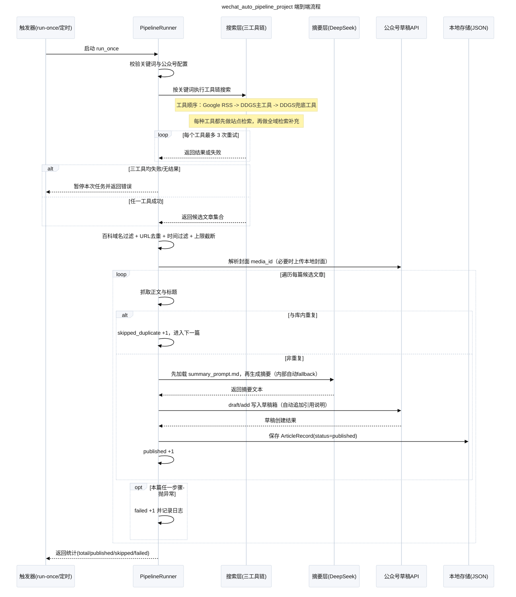

# 产品流程图

## 完整工作流程（简化时序图）

## 节点与代码一一映射（审阅用）

- `启动 run_once` -> `src/pipeline.py` 中 `PipelineRunner.run_once()`
- `校验关键词与公众号配置` -> `parsed_queries()`、`wechat_ready()` 两个前置判断
- `按关键词执行工具链搜索` -> `search_with_toolchain(query, max_results, max_attempts_per_tool=3)`
- `站点优先 + 全域补充` -> `_search_site_then_global_async()` / `_search_site_then_global_sync()`
- `工具1：Google RSS` -> `google_news_search()`
- `工具2：DDGS主工具` -> `ddgs_primary_search()`（通过 `asyncio.to_thread` 调用）
- `工具3：DDGS兜底工具` -> `ddgs_fallback()`（通过 `asyncio.to_thread` 调用）
- `百科域名过滤` -> `_is_blocked_url()` + `ENCYCLOPEDIA_BLOCKLIST`
- `单工具重试（最多3次）` -> `_with_retries(..., max_attempts=3)`
- `三工具均失败即暂停` -> `pipeline.run_once` 中 `if not rows: raise RuntimeError(...)`
- `URL去重 + 时间过滤 + 上限截断` -> `unique` 字典去重 + `filter_by_age()` + `candidates[:max_publish_per_run]`
- `解析封面 media_id` -> 读取 `WECHAT_MP_THUMB_MEDIA_ID`，为空则 `upload_local_cover()`
- `抓取正文与标题` -> `_fetch_text(url, fallback_title, fallback_snippet)`
- `重复判断` -> `store.exists_duplicate(url, title, text)`
- `生成摘要` -> 先加载 `docs/summary_prompt.md`，再 `summarizer.summarize(title, text, max_chars=2200)`
- `写入公众号草稿` -> `wechat.add_draft(...)`（正文末尾自动追加“引用说明 + 原文链接”）
- `入库 published` -> 构建 `ArticleRecord` 后 `store.add(rec)`
- `统计返回` -> `RunStats(total_candidates, published, skipped_duplicate, failed)` 并 `return`

## 执行逻辑说明（便于核查）

1. 任务被手动或定时触发后，先检查配置是否满足运行条件。
2. 用关键词逐个检索：按 Google RSS -> DDGS主工具 -> DDGS兜底工具 依次尝试。
3. 每个工具都先按目标站点检索，再做全域检索补充。
4. 返回结果先过滤百科类域名，再做 URL 去重、发布时间过滤与数量上限截断。
5. 每个搜索工具最多重试 3 次，失败后切换下一个工具。
6. 三个工具都失败/无结果时，暂停本次任务并抛出错误。
7. 处理每篇候选时，先抓正文，再判断是否已存在重复内容。
8. 非重复文章会先加载 `summary_prompt.md`，再生成摘要并调用草稿接口写入公众号。
9. 草稿正文会自动追加“引用说明 + 原文链接”；写入成功才入库为 `published`。
10. 任一步骤异常计入 `failed`；循环结束后返回本次统计。
